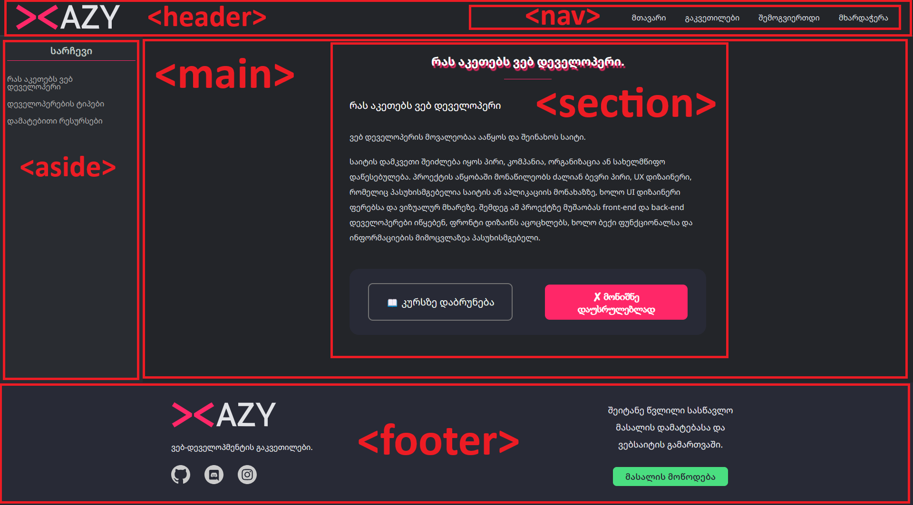

# სემანტიკური HTML

რამდენადაც კარგი არ უნდა იყოს `<div>` და `<span>` ელემენტები, ისინი ჩვეულებრივ კონტეინერად გამოდგებიან, მაგრამ არ არის კარგი a11y-სთვის. 

## გაკვეთილის მიმოხილვა

- გაიგებთ, რატომ არის სემანტიკური HTML მნიშვნელოვანი ხელმისაწვდომობისთვის.
- ისწავლით შხვიდ HTML ელემენტს, რომელიც გვერდზე განლაგებებს აღნიშნავს.

## სემანტიკურობის მნიშვნელობა

ვებ ხელმისაწვდომობისთვის სემანტიკური HTML-ს გამოყენება მნიშვნელოვანია, რადგან ის გვაწვდის მნიშვნელობას და კონტექსტს. ზოგ ელემენტს აქვს სემანტიკური მნიშვნელობა, მაგრამ დამხმარე ტექნოლოგიებისთვის არანაირ კონტექსტს არ აძლევენ, მაგალითად `<p>` ელემენტი. ასევე არიან ელემენტები, რომელთაც აქვთ სემანტიკური მნიშვნელობა და აწვდიან კონტექსტს, მაგალითად `<button>`.

`<div>` და `<span>` ელემენტები, ალბათ, ყველაზე ხშირად გამოყენებული ელემენტები არიან. მათ არ აქვთ სემანტიკური მნიშვნელობა და კონტექსტს არ აწვდიან დამხმარე ტექნოლოგიებს, რაც უფრო რთულს ხდის ამ ტექნოლოგიების მომხმარებლებისთვის საიტის გამოყენებას. არ ჩათვალოთ, რომ ყველგან სემანტიკური ელემენტები უნდა გამოიყენოთ. `<div>` და `<span>` ელემენტები ჩვეულებრივ კონტეინერებად გამოდგება.

ახლა რეალურ მაგალითებზე გადავიდეთ, რაც დაგვეხმარება ამ სემანტიკური ელემენტების და კონტექსტის გაგებაში. გაიხსენეთ თქვენი დასრულებული პროექტები, სადაც მომხმარებელს მოუწია რაიმეზე დაჭერა, მაგალითად "Rock, Paper, Scissors", კალკულატორი, იქსიკი და ნულიკი. თუ თქვენ გამოიყენეთ `<div>` ან `<span>` დასაკლიკებელ ადგილებში, ბოლომდე იდეალური არაა.

```html
<!-- ესენი ღილაკებია? -->
<div class='button-container'>
  <div class='rock'>Rock</div>
  <div class='paper'>Paper</div>
  <div class='scissors'>Scissors</div>
</div>
```

ჩვეულებრივ მომხმარებლებს არანაირი პრობლემა არ შეექმნებათ, თუ ისინი გამოიყურებიან, როგორც ელემენტები, რომელთანაც ინტერაქცია სეიძლება. ეკრანის წამკითხველ ხელსაწყოს კი წარმოდგენა არ ექნება ეს ელემენტები რას ნიშნავს. ეკრანის წამკითხველი უბრალოდ გამოაცხადებს ტექსტს ამ ელემენტებში ("Rock", "Paper", "Scissors") და მომხმარებელი იფიქრებს, რომ ეს უბრალო ტექსტია. 

ეს პრობლემა ადვილად გადაიჭრება სემანტიკური HTML-თი:

```html
<!-- ესენი ნამდვილად ღილაკებია -->
<div class='button-container'>
  <button class='rock'>Rock</button>
  <button class='paper'>Paper</button>
  <button class='scissors'>Scissors</button>
</div>
```

რადგანაც `<button>` ელემენტს აქვს სემანტიკური მნიშვნელობა და გვაწვდის კონტექსტს, ეკრანის წამკითხველი გამოაცხადებს ტექსტს და მის როლს: "Rock, button".

### სემანტიკური HTML-ს სწორად გამოყენება

- როდესაც საქმე ეხება სემანტიკური HTML-ს სწორად გამოყენებას, არ აქვს მნიშვნელობა ნამდვილად ღილაკია თუ არა, თქვენ დაგჭირდებათ `<button>` ელემენტი. ეს ეუბნება მომხმარებელს, რომ ამ ელემენტზე ინტერაქცია დაკლიკებით შეიძლება.
- თუ გსურთ რაიმე ცხრილის ინფორმაციის მიწოდება მომხმარებლისთის, გამოიყენეთ `<table>` ელემენტი სხვა მის სესაბამის ელემენტებთან ერთად. ეს მისცემს მომხმარებელს ადვილი ნავიგაციის და წარმოდგენილი ინფორმაციის გაგების შესაძლებლობას.
- როდესაც იყენებთ ინფუთ ელემენტს, ყოველთვის უნდა მიანიჭოთ თითოეულს `<label>` ელემენტი. `<label>` ელემენტი გვაძლევს კონტექსტს რაზეა ინფუთი, ყოველი ინფუთის არჩევისას ეკრანის წამკითხველი დანიშნულებას აცხადებს. ასევე `<label>` ზრდის კლიკის არეას, რომელიც უკეთეს სივრცეს უქმნის მომხმარებლებს, რომლებსაც უჭირთ პატარა რაღაცეებზე დაკლიკება. ამისთვის არსებობს ორი გზა:

```html
<!-- გამოსადეგია, როდესაც გსურთ ინფუთს ჰქონდეს საკუთარი ID -->
<label for='name'>სახელი</label>
<input type='text' id='name' />

<!-- ID-ს გარეშე -->
<label>
  სახელი
  <input type='text' />
</label>
```

- ინფუთს აუცილებლად უნდა ჰქონდეს `type`. `type="text"` უკვე კონტექსტს აძლევს ინფუთს. სწორი `type`-ს გამოყენება დამატებით სიმბოლოებს ამატებს კლავიატურას, რაც უფრო ადვილს ხდის გამოყენებას. `type="tel"` ინფუთზე დაჭერისას, მხოლოდ ციფრების კლავიატურა გაიხსნება, სადაც დიდად ეწერება ყველა ციფრი და უფრო ადვილი იქნება ჩაწერა. 
- როდესაც გსურთ სია წარუდგინოთ მომხმარებელს, აუცილებლად უნდა გამოიყენოთ შესაბამისი ელემენტი (`ol>`, `<ul>` ან `<dl>`) და მათთან დაკავშირებული ელემენტები. ეს მომხმარებელს ეტყვის როდის იწყება სია და როდის მთავრდება, ასევე რამდენი აითემია სიაში.

## სათაურები და სივრცეები

სათაურები იწერება `<h1>` დან `<h6>`-მდე ელემენტების გამოყენებით და როგორც სათაური გვეუბნება, გვერდის სათაურად გამოიყენება. სივრცეები არიან HTML ელემენტები, რომლებიც ითვისებენ გვერდის სხვადასხვა რეგიონებს/ადგილებს. ამ სივრცეებისთვის გამოიყენება შვიდი ძირითადი ელემენტი:

- `<aside>`
- `<footer>`
- `<form>`
- `<header>`
- `<main>`
- `<nav>`
- `<section>`

ამ მაგალითში ნახავთ, რა სემანტიკური თეგებია ჩვენთან გამოყენებული. თუ გსურთ ზუსტად გაიგოთ, გადაავლეთ გვერდს თვალი დეველოპერის ხელსაწყოს (inspect) გამოყენებით.



ამ წესების დაცვით, დამხმარე ტექნოლოგიების მომხმარებლებს ვუადვილებთ საქმეს გაიგონ რა ხდება გვერდზე.

აქ მხოლოდ `<div>`-ს რომ ვიყენებდეთ, ეკრანის წამკითხველი ვერ მოახერხებს კონკრეტულ სექციებზე ფოკუსირებას და ვერ მიხვდება გვერდის რა ნაწილია.

## დავალება

<div className="homework">

1. [გადახედეთ როგორ მუშაობენ ეკრანის წამკითველები ცხრილებზე](https://tink.uk/how-screen-readers-navigate-data-tables/), რათა უკეთ გაიგოთ, რა კონტექსტს გვაწვდიან `<table>` ელემენტები. ბლოგის ბოლოს შეგიძლიათ გაიგოთ როგორ აცხადებენ ცხრილს.

2. უყურეთ [რატომ არის სათაურები და სივრცეები ძალიან მნიშვნელოვანი](https://www.youtube.com/watch?v=vAAzdi1xuUY&list=PLNYkxOF6rcICWx0C9LVWWVqvHlYJyqw7g&index=19) და ნახეთ როგორ არენდერებს წამკითხველი ეკრანს.

</div>

## დამატებითი რესურსები

- [NVAccess](https://www.nvaccess.org/download/) გვაძლევს საშუალებას ჩავიწეროთ NVDA ეკრანის წამკითხველი, რომელიც ერთ-ერთი ყველაზე პოპულარული და უფასო აპლიკაციაა, რომელიც მხოლოდ ვინდოუსზეა ხელმისაწვდომი.
- ნახეთ [ეკრანის წამკითხველი ხმით](https://www.youtube.com/watch?v=5R-6WvAihms&list=PLNYkxOF6rcICWx0C9LVWWVqvHlYJyqw7g&index=8) და [NVDA ეკრანის წამკითხველი](https://www.youtube.com/watch?v=Jao3s_CwdRU&list=PLNYkxOF6rcICWx0C9LVWWVqvHlYJyqw7g&index=9), რომელიც ბევრ ინფორმაციას მოგცემთ.
- გადახედეთ [ამ რესურსს](https://www.w3.org/WAI/ARIA/apg/patterns/landmarks/examples/HTML5.html), რათა გაიგოთ როგორაა გვერდი დაყოფილი სექციებად.


